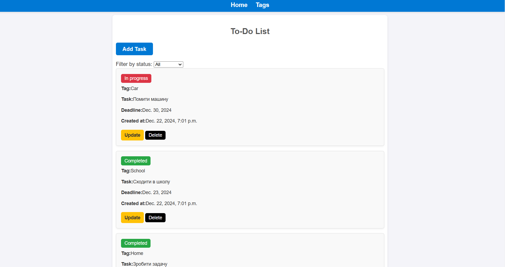
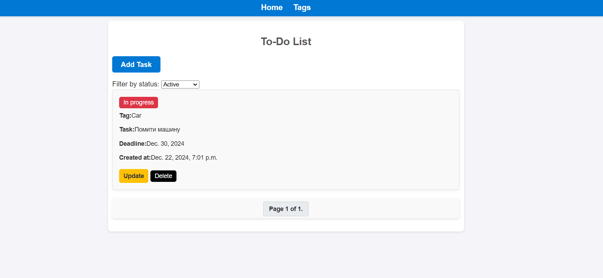
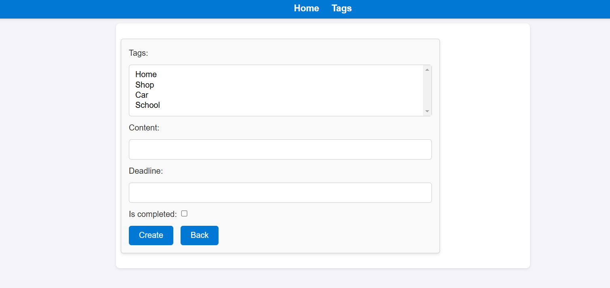
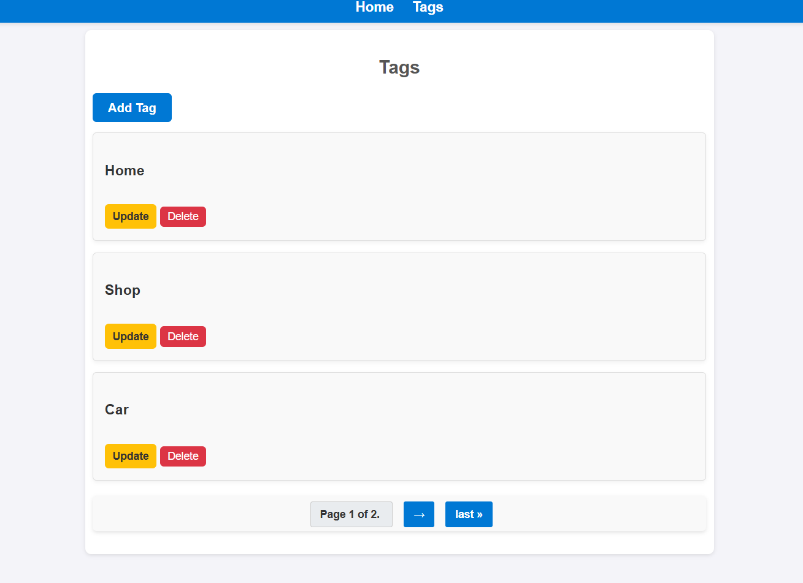
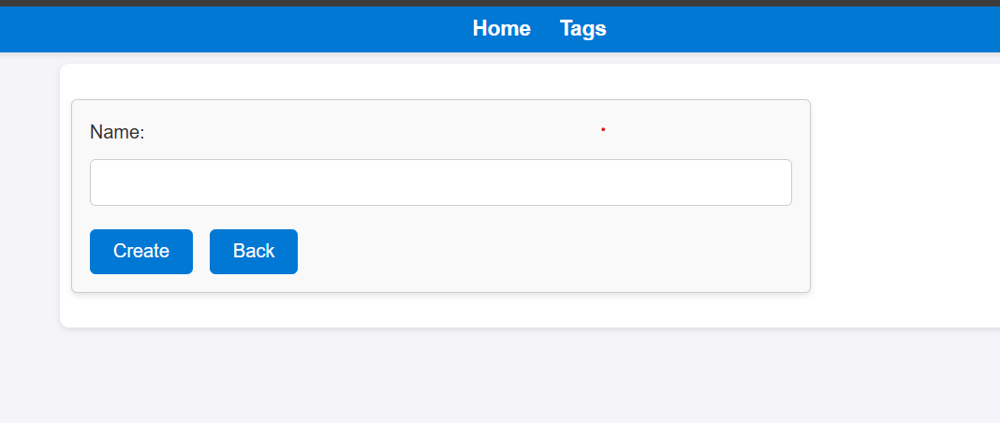

# Mini To-Do List

Mini To-Do List is a simple web application for managing tasks. The application allows you to create, edit, delete tasks, change their status, filter tasks by status, and work with tags to organize tasks.

## 🚀 Technologies
The project is built using:
- 🐍 **Backend**: Python + Django
- 🗄️ **Database**: SQLite
- 🌐 **Frontend**: HTML, CSS
- 🔄 **Version Control**: Git

## 🔑 Core Logic and Features
- 🔐 **Home**:
  - Displays a list of all tasks.
  - ➕ Allows creating new tasks.
  - 🔄 Change the status of a task (e.g., "Completed" or "In Progress").
  - ✏️ Edit, update, and delete tasks.
  - 🔍 Filter tasks by status.

- 🏷️ **Tags Page**:
  - Displays a list of tags (themes for tasks).

Note: The project does not include authentication or deployment to a server.

## 📦 Installation

1. **Clone the repository**:
```bash
   git clone https://github.com/your-username/mini-to-do-list.git
   cd mini-to-do-list
```
2. **Create a virtual environment**
```bash
    python -m venv venv
    source venv/bin/activate  # For Linux/Mac
    venv\Scripts\activate     # For Windows
```

3. **Install dependencies**
```bash
    pip install -r requirements.txt
   ```

4. **Run the server**
```bash
    python manage.py runserver
    # Open the application in your browser
    # The application will be available at:
    # http://127.0.0.1:8000
```

## 🧩 Project Structure

```
mini-to-do-list/
├── core/                # Application logic (models, views, urls)
│   ├── migrations/      # Database migrations
│   ├── admin.py         # Admin panel
│   ├── apps.py          # App configuration
│   ├── forms.py         # Forms for handling requests
│   ├── models.py        # Database models
│   ├── tests.py         # Tests
│   ├── urls.py          # Routing
│   ├── views.py         # Request handlers
├── mini_to_do_list/     # Project configuration
├── templates/           # HTML templates
├── static/              # CSS and static files
├── manage.py            # Django CLI
├── db.sqlite3           # SQLite database
├── requirements.txt     # Dependencies
└── README.md            # Project description
```

## 🖼️ User Interface

### Home Page


### Tasks with filter


### Create Task


### Tags Page


### Create Tag



## 👤 Author
**Vladyslav Rymarchuk**  
[GitHub](https://github.com/b4oody/) | [LinkedIn](https://www.linkedin.com/in/%D0%B2%D0%BB%D0%B0%D0%B4%D0%B8%D1%81%D0%BB%D0%B0%D0%B2-%D1%80%D0%B8%D0%BC%D0%B0%D1%80%D1%87%D1%83%D0%BA-aa62a4202/)
